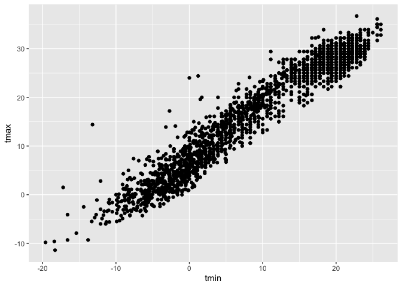
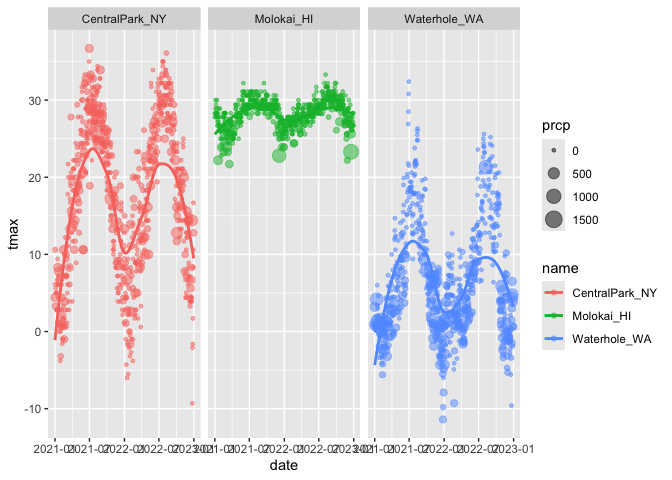
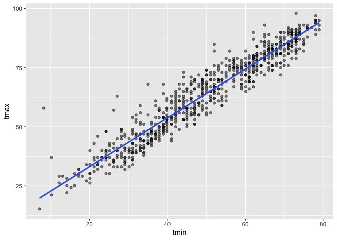
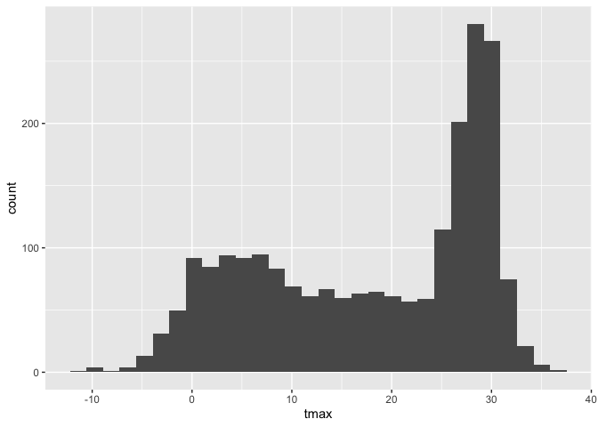
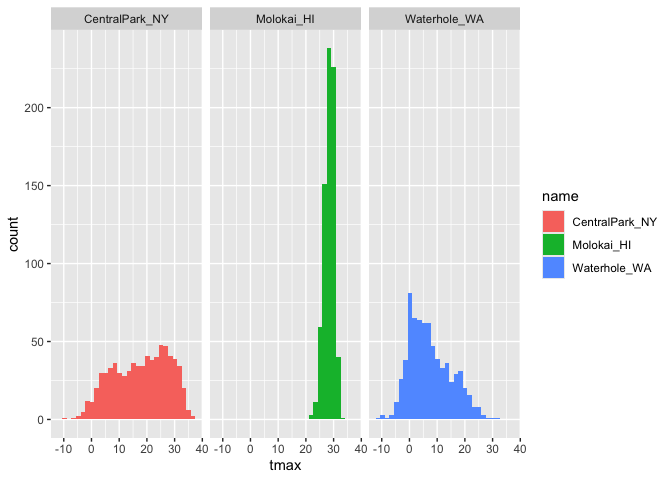
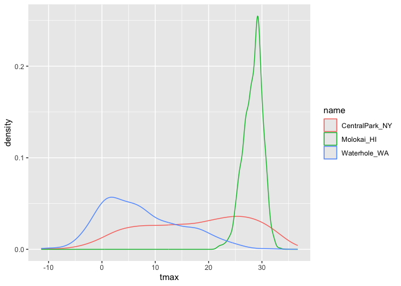
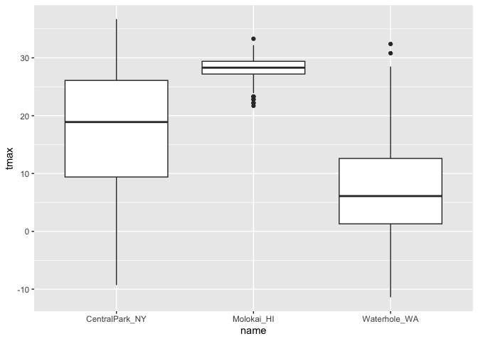
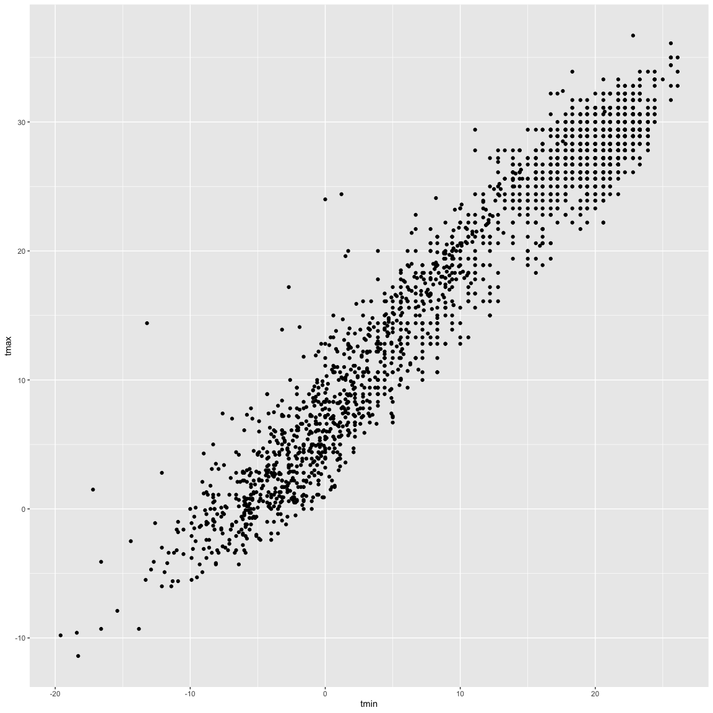

Visualization
================
2026-10-01

``` r
library(tidyverse)
```

    ## ── Attaching core tidyverse packages ──────────────────────── tidyverse 2.0.0 ──
    ## ✔ dplyr     1.2.1     ✔ readr     2.2.0
    ## ✔ forcats   1.0.1     ✔ stringr   1.6.0
    ## ✔ ggplot2   4.0.3     ✔ tibble    3.3.1
    ## ✔ lubridate 1.9.5     ✔ tidyr     1.3.2
    ## ✔ purrr     1.2.2     
    ## ── Conflicts ────────────────────────────────────────── tidyverse_conflicts() ──
    ## ✖ dplyr::filter() masks stats::filter()
    ## ✖ dplyr::lag()    masks stats::lag()
    ## ℹ Use the conflicted package (<http://conflicted.r-lib.org/>) to force all conflicts to become errors

``` r
library(ggridges)

library(p8105.datasets)
data("weather_df")
```

``` r
weather_df #365 days, 2 years, 3 weather stations
```

    ## # A tibble: 2,190 × 6
    ##    name           id          date        prcp  tmax  tmin
    ##    <chr>          <chr>       <date>     <dbl> <dbl> <dbl>
    ##  1 CentralPark_NY USW00094728 2021-01-01   157   4.4   0.6
    ##  2 CentralPark_NY USW00094728 2021-01-02    13  10.6   2.2
    ##  3 CentralPark_NY USW00094728 2021-01-03    56   3.3   1.1
    ##  4 CentralPark_NY USW00094728 2021-01-04     5   6.1   1.7
    ##  5 CentralPark_NY USW00094728 2021-01-05     0   5.6   2.2
    ##  6 CentralPark_NY USW00094728 2021-01-06     0   5     1.1
    ##  7 CentralPark_NY USW00094728 2021-01-07     0   5    -1  
    ##  8 CentralPark_NY USW00094728 2021-01-08     0   2.8  -2.7
    ##  9 CentralPark_NY USW00094728 2021-01-09     0   2.8  -4.3
    ## 10 CentralPark_NY USW00094728 2021-01-10     0   5    -1.6
    ## # ℹ 2,180 more rows

Let’s make a scatterplot!

``` r
ggplot(weather_df, aes(x = tmin, y = tmax)) + 
  geom_point()
```

    ## Warning: Removed 17 rows containing missing values or values outside the scale range
    ## (`geom_point()`).

<!-- -->

``` r
# the first thing in the argument is the name of the dataset
# x = the variable you want on the x axis
# y = the variable you want on the y axis
# this creates a scatter plot
```

He likes the dataframe first.

``` r
ggp_temp_scatterplot = 
  weather_df |> 
  ggplot(aes(x = tmin, y = tmax)) +
  geom_point()

ggp_temp_scatterplot
```

    ## Warning: Removed 17 rows containing missing values or values outside the scale range
    ## (`geom_point()`).

<!-- -->

``` r
# this does the same thing as the first chunk
```

Let’s make this a bit fancier…

``` r
weather_df |> 
  ggplot(aes(x = tmin, y = tmax, color = name)) +
  geom_point(alpha = .25) + #alpha makes points a bit transparent
  geom_smooth(se = FALSE) #adds a smooth line through the points; gives error bars by default so se=F gets rid of them 
```

    ## `geom_smooth()` using method = 'loess' and formula = 'y ~ x'

    ## Warning: Removed 17 rows containing non-finite outside the scale range
    ## (`stat_smooth()`).

    ## Warning: Removed 17 rows containing missing values or values outside the scale range
    ## (`geom_point()`).

<!-- -->

``` r
# "color = name" makes the data points that correspond to the different values of the variable "name" different colors, and creates a legend to show what values the colors correspond to 
```

``` r
#only 1 smooth line
weather_df |> 
  ggplot(aes(x = tmin, y = tmax)) +
  geom_point(aes(color = name), alpha = .25) + #alpha makes points a bit transparent; adding aes makes it so that colors are only defined for points and won't show up in geom_smooth
  geom_smooth(se = FALSE) #adds a smooth line through the points; gives error bars by default so se=F gets rid of them 
```

    ## `geom_smooth()` using method = 'gam' and formula = 'y ~ s(x, bs = "cs")'

    ## Warning: Removed 17 rows containing non-finite outside the scale range
    ## (`stat_smooth()`).

    ## Warning: Removed 17 rows containing missing values or values outside the scale range
    ## (`geom_point()`).

<!-- --> the
aesthetics are up to you

``` r
#no points
weather_df |> 
  ggplot(aes(x = tmin, y = tmax, color = name)) +
  geom_smooth(se = FALSE) 
```

    ## `geom_smooth()` using method = 'loess' and formula = 'y ~ x'

    ## Warning: Removed 17 rows containing non-finite outside the scale range
    ## (`stat_smooth()`).

<!-- -->

Show faceting

``` r
weather_df |> 
  ggplot(aes(x = tmin, y = tmax, color = name)) +
  geom_point(alpha = 0.5) +
  facet_grid(. ~ name) #nothing separating rows, name separates cols; switching to facet_grid(name ~ .) leads to graphs on top of each other
```

    ## Warning: Removed 17 rows containing missing values or values outside the scale range
    ## (`geom_point()`).

<!-- -->

``` r
# the last line makes it so there are x amount of graphs for x number of different values of the variable "name". Each graph only contains the data points that correspond with that value of the variable "name"
```

``` r
#does same thing as above, just a diff way to have column specification
weather_df |> 
  ggplot(aes(x = tmin, y = tmax, color = name)) +
  geom_point(alpha = 0.5) +
  facet_grid(cols = vars(name))
```

    ## Warning: Removed 17 rows containing missing values or values outside the scale range
    ## (`geom_point()`).

<!-- -->

Let’s look at something else.

``` r
weather_df |> 
  ggplot(aes(x = date, y = tmax, color = name)) + 
  geom_point(aes(size = prcp), alpha = 0.5) +
  geom_smooth(se = FALSE) +
  facet_grid(. ~ name)
```

    ## `geom_smooth()` using method = 'loess' and formula = 'y ~ x'

    ## Warning: Removed 17 rows containing non-finite outside the scale range
    ## (`stat_smooth()`).

    ## Warning: Removed 19 rows containing missing values or values outside the scale range
    ## (`geom_point()`).

<!-- -->

``` r
# x is now the date instead of the minimum temp

# this links the temperature datapoints with the corresponding precipitation data points
```

Make a plot of Central Park tmax and tmin only, and convert temperatures
to farenheit

``` r
weather_df |> 
  filter(name == "CentralPark_NY") |> 
  mutate(
    tmax = tmax * (9/5) + 32,
    tmin = tmin * (9/5) + 32
  ) |> 
  ggplot(aes(x = tmin, y = tmax)) +
  geom_point(alpha = 0.5) + 
  geom_smooth(method = "lm", se = FALSE)
```

    ## `geom_smooth()` using formula = 'y ~ x'

<!-- -->

what’s a hex plot

``` r
weather_df |> 
  ggplot(aes(x=tmin, y=tmax))+
  geom_hex() #gives an idea of the data summary and what it looks like. more shading = more common
```

    ## Warning: Removed 17 rows containing non-finite outside the scale range
    ## (`stat_binhex()`).

<!-- -->

## Univariate plots (distribution of single variables)

``` r
weather_df |> 
  ggplot(aes(x = tmax)) + 
  geom_histogram()
```

    ## `stat_bin()` using `bins = 30`. Pick better value `binwidth`.

    ## Warning: Removed 17 rows containing non-finite outside the scale range
    ## (`stat_bin()`).

<!-- -->

``` r
# creates a histogram
```

``` r
weather_df |> 
  ggplot(aes(x = tmax, fill=name)) + #color = boundary of bar instead of fill, so use fill instead
  geom_histogram(position = "dodge") # dodge makes it so bars don't overlap
```

    ## `stat_bin()` using `bins = 30`. Pick better value `binwidth`.

    ## Warning: Removed 17 rows containing non-finite outside the scale range
    ## (`stat_bin()`).

<!-- -->

``` r
weather_df |> 
  ggplot(aes(x = tmax, fill=name)) + #color = boundary of bar instead of fill, so use fill instead
  geom_histogram()+
  facet_grid(. ~ name) # better than dodge
```

    ## `stat_bin()` using `bins = 30`. Pick better value `binwidth`.

    ## Warning: Removed 17 rows containing non-finite outside the scale range
    ## (`stat_bin()`).

<!-- -->

``` r
# again, last line makes it so there are x amount of graphs for x number of different values of the variable "name".
```

Density plots are great!!

``` r
weather_df |> 
  ggplot(aes(x=tmax, color=name)) +
  geom_density()
```

    ## Warning: Removed 17 rows containing non-finite outside the scale range
    ## (`stat_density()`).

<!-- -->

``` r
# gives lines instead of bars (as in histograms)

weather_df |> 
  ggplot(aes(x=tmax, fill=name)) +
  geom_density(alpha= .3)
```

    ## Warning: Removed 17 rows containing non-finite outside the scale range
    ## (`stat_density()`).

<!-- -->

``` r
# here, color= makes the lines different colors, while fill= keeps the lines black but shades the insides different colors

# alpha= makes it transparent. The closer to 1, the less transparent, the closer to 0, the more transparent. 
```

Boxplots

``` r
weather_df |> 
  ggplot(aes(x = name, y = tmax)) + #adding x separates out the 3 boxplots by name
  geom_boxplot()
```

    ## Warning: Removed 17 rows containing non-finite outside the scale range
    ## (`stat_boxplot()`).

<!-- -->

Violin plots

``` r
weather_df |> 
  ggplot(aes(x = name, y = tmax)) + 
  geom_violin() # shows distribution info (density plots on the side and mirrored); like a combined density and box plot
```

    ## Warning: Removed 17 rows containing non-finite outside the scale range
    ## (`stat_ydensity()`).

<!-- -->

Ridge plots

``` r
weather_df |> 
  ggplot(aes(x = tmax, y = name)) + 
  geom_density_ridges() #separates curves horizontally; helpful if you have a lot of categories
```

    ## Picking joint bandwidth of 1.54

    ## Warning: Removed 17 rows containing non-finite outside the scale range
    ## (`stat_density_ridges()`).

<!-- -->

## Save some of the plots

``` r
ggp_weather = 
  weather_df |> 
  ggplot(aes(x = date, y = tmax, color = name)) +
  geom_point(aes(size = prcp), alpha = 0.5) +
  facet_grid(.~name)

ggp_weather
```

    ## Warning: Removed 19 rows containing missing values or values outside the scale range
    ## (`geom_point()`).

<!-- -->

``` r
ggsave("images/ggp_weather.pdf", ggp_weather)
```

    ## Saving 7 x 5 in image

    ## Warning: Removed 19 rows containing missing values or values outside the scale range
    ## (`geom_point()`).

``` r
weather_df |> 
  ggplot(aes(x=tmin, y = tmax))+
  geom_point()
```

    ## Warning: Removed 17 rows containing missing values or values outside the scale range
    ## (`geom_point()`).

<!-- -->

``` r
# the line at the top specifies the size of the image
```

to fix the size of the images, can use:

knitr::opts_chunk\$set( fig.width = 6, fig.asp = .6, out.width = “90%” )
